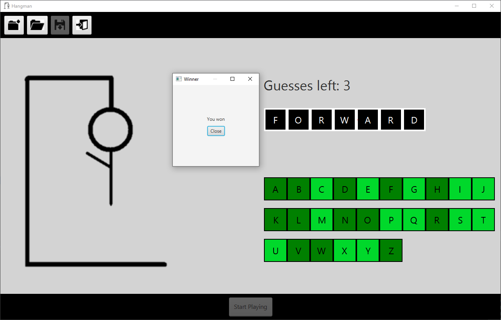

# Hangman
A hangman game created using JavaFX
This program was developed around Fall 2019

## Features

- The program contains four core button: New Game, Load Game, Save Game, and Exit Program from left to right 
- You can save a game that is in progress
- You can load saved games
- Displays the number of guesses the user has left
- Allows the user to either click on the letters or use their keyboard
- Features a stickman figure

## Examples

### Game in progress

### Won game

### Lost game

## Setup using IntelliJ

Note: Preferably use Java 8 for this project

1. Clone the project and then open it in IntelliJ

2. Create a new folder that will store the compiler output

3. Go to File > Project Structure and select the "Project" tab on the left sidebar and then do the following:

   - Choose a SDK (as mentioned above a version 8 JDK is preferable)
   - Change the "Project language level" to level 8
   - Under the project compiler output field select the output folder we created earlier

4. In the same window change the tab to "Modules" and do the following:

   - Remove the content root and then add the content root back in. The content root should be the root folder of the project. 
     This step ensures that our content root will work properly.
     
5. Build the project

6. Go to Run > Edit Configurations and do the following:

   - Select the application template
   - Choose the main class which will be the "Hangman" class
   - Make sure the module is Hangman and the JRE is set to default which should point to the SDK we chose earlier
   
7. Run the project and enjoy!
